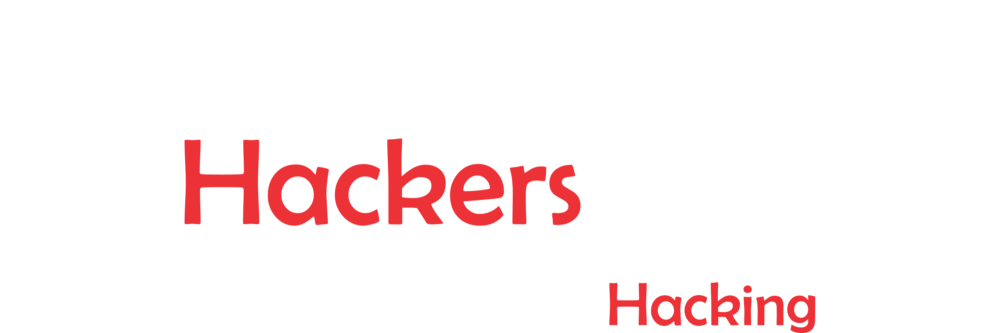

# 0x1337: The Hacking Club

**0x1337** is the **Hacking Club of IIITH**. We are a club based on ethical hacking, where we try to familiarize people with different tools and ways of ethical hacking and make them aware about how cybersecurity is so important in today’s world.

No prior knowledge is required to start learning about cybersecurity, just read some of our advice in [/read-me](read-me) to get started!

You can see some of our previous and upcoming events in [/events](events).

Check out our amazing team in [/members](members).

## Check out our latest upcoming CTF [TheDeccanCTF](/ctf)

 

# Community partner:

The Hackers Meetup is a fantastic initiative that conducts regular meetups in various cities across India, featuring experienced speakers and delivering engaging content. Known for being beginner-friendly and highly supportive, they are a great resource for anyone interested in cybersecurity and hacking.

Take a look at their work, and consider attending their events to expand your knowledge and network with like-minded individuals.
